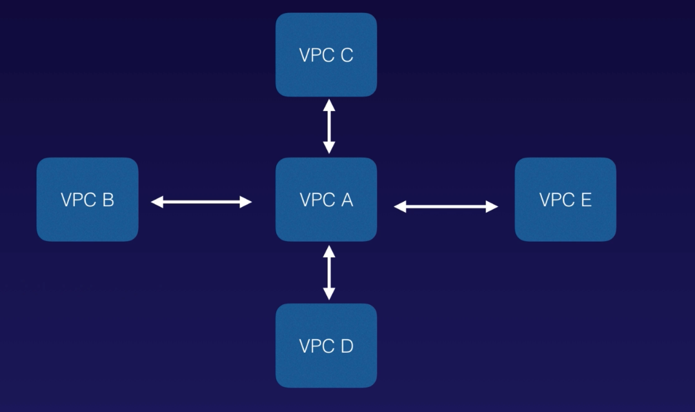
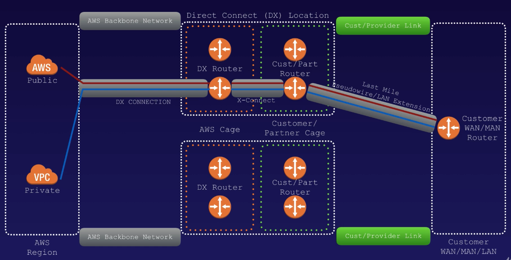

# VPC

[https://docs.aws.amazon.com/vpc/latest/userguide/what-is-amazon-vpc.html](https://docs.aws.amazon.com/vpc/latest/userguide/what-is-amazon-vpc.html)

**3 sets of ip address reserved for private ip address ranges**

* 10.0.0.0 - 10.255.255.255 \(10/8 prefix\)
* 172.16.0.0 - 172.31.255.255 \(172.16/12 prefix\)
* 192.168.0.0 - 192.168.255.255 \(192.168/16 prefix\)

**1 Subnet = 1 Availability Zone**

* You **cannot** have a subnet stretched over multiple Availability Zones.
* You **can** have multiple subnets in the same Availability Zone.

**Only 1 internet gateway per VPC**

**What can we do with a VPC**

* Launch instances into a subnet of your choosing
* Assign custom IP address ranges in each subnet
* Configure route tables between subnets
* Create internet gateway and attach it to your VPC
* Much better security control over your AWS resources
* Instance security groups
* Subnet network access control lists\(ACLs\)

**VPC Peering**

* Allows you to connect one VPC with another via a direct network route using private IP addresses
* Instances behave as if they were on the same private network
* You can peer VPCs with other AWS accounts as well as with other VPCs in the same account
* Peering is in a star configuration - 1 central VPC peers with 4 others \(No Transitive Peering\)
* You can peer between regions.

No Transitive Peering means \(instances in\) VPC B can talk to VPC A, VPC C can talk to VPC A, but VPC B cannot talk to VPC C..

**NAT \(Network Address Translation\) -** allows private subnets communicate out to the Internet without becoming public.

**NAT Instance** - A single EC2 instance \(outdated but still in the exam\)

* When creating a NAT instance, Disable Source/Destination Check on the instance.
* NAT instances must be in a public subnet.
* There must be a route out of the private subnet to the NAT instance, in order for this to work.
* The amount of traffic that NAT instances can support depends on the instance size. If you are bottlenecking, increase the instance size.
* You can create high availability using Autoscaling Group, multiple subnets in different AZs, and a script to automate failover.
* NAT instances are always behind a Security Group.

**NAT Gateway** - A highly available gateway that spreading across multiple Availability Zones.

* Redundant inside the Availability Zone \(You can only have one NAT gateway inside one Availability Zone. NAT gateways cannot span AZs.\)
* Preferred by the enterprise.
* Starts at 5 Gbps and scales currently to 45 Gbps automatically
* No need to patch
* Not associated with security groups
* Automatically assigned a public ip address
* Remember to update your route tables
* No need to Disable Source/Destination Check
* If you have resources in multiple AZs and they share one NAT gateway, in the event that the NAT gateway's AZ is down, resources in the other AZ lose internet access. **To create an AZ-independent architecuture, create a NAT gateway in each AZ and configure your routing to ensure that resources use the NAT gateway in the same AZ.**

**ACL\(Access Control Lists\)**

* Your VPC automatically comes with a default network ACL, and by default it allows all outbound and inbound traffic.
* You can create custom network ACLs. By default, each custom network ACL denies all inbound and outbound traffic until you add rules.
* Each subnet in your VPC must be associated with a network ACL. If you don't explicitly associate a subnet with a network ACL, the subnet is automatically associated with the default network ACL.
* Block IP addresses using network ACLs not Security Groups.
* You can associate a network ACL with mulptiple subnets. However, a subnet can be associated with only one network ACL at a time. When you associate a network ACL with a subnet, the previous association is removed.
* Network ACLs contain a numbered list of rules that is evaluated in order, starting with the lowest numbered rule.
* Network ACLs have separate inbound and outbound rules, and each rule can either allow or deny traffic.
* Network ACLs are stateless; responses to allowed inbound traffic are subject to the rules for outbound traffic \(and vice versa\). - **Security groups are stateful, so you don't need to do that.**

**You need at least 2 public subnets in order to create a load balancer.**

**VPC Flow Logs**

* Flow logs can be created at 3 levels:
  * VPC
  * Subnet
  * Network Interface
* You cannot enable flow logs for VPCs that are peered with your VPC unless the peer VPC is in your account.
* You can tag flow logs.
* After you've created a flow log, you cannot change its configuration; e.g. you cannot associate a different IAM role with the flow log.
* Not all IP traffic is monitored
  * Traffic generated by instances when they contact with the Amazon DNS server. If you use your own DNS server, then all traffic to that DNS server is logged.
  * Traffic generated by a Windows instance for Amazon Windows license activation is not monitored.
  * Traffic to and from 169.254.169.254 for instance metadata is not monitored.
  * DHCP traffic is not monitored
  * Traffic to the reserved IP address for the default VPC router is not monitored.

**Bastion**

* A NAT Gateway or NAT instance is used to provide internet traffic to EC2 instances in a private subnets.
* A Bastion is used to securely administer EC2 instances \(using SSH or RDP\). 
* You cannot use a NAT Gateway as a Bastion host.

**Direct Connect**

* Direct Connect directly connects your data center to AWS
* Useful for high throughput workloads \(i.e. lots of network traffic\)
* Or if you need a stable and reliable secure connection.d

