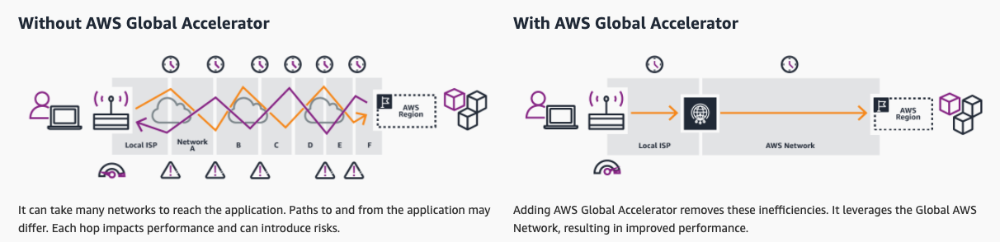
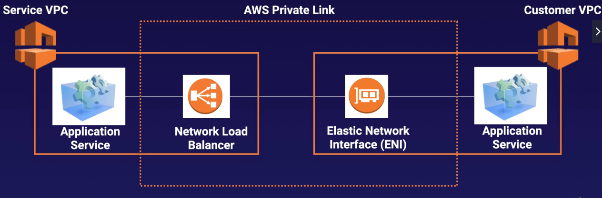
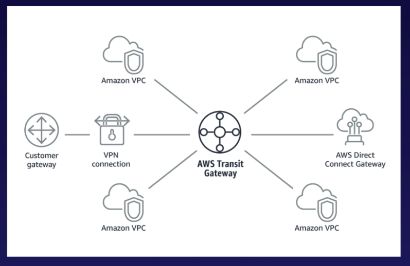
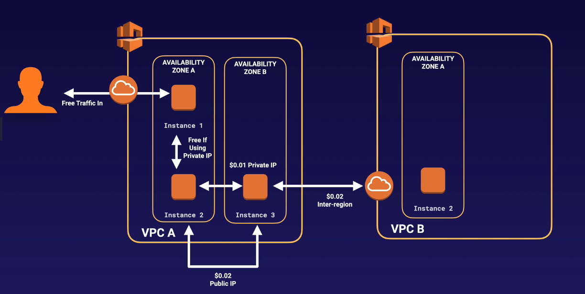

# VPC

[https://docs.aws.amazon.com/vpc/latest/userguide/what-is-amazon-vpc.html](https://docs.aws.amazon.com/vpc/latest/userguide/what-is-amazon-vpc.html)

**3 sets of ip address reserved for private ip address ranges**

* 10.0.0.0 - 10.255.255.255 \(10/8 prefix\)
* 172.16.0.0 - 172.31.255.255 \(172.16/12 prefix\)
* 192.168.0.0 - 192.168.255.255 \(192.168/16 prefix\)

**1 Subnet = 1 Availability Zone**

* You **cannot** have a subnet stretched over multiple Availability Zones.
* You **can** have multiple subnets in the same Availability Zone.

**Only 1 internet gateway per VPC**

**What can we do with a VPC**

* Launch instances into a subnet of your choosing
* Assign custom IP address ranges in each subnet
* Configure route tables between subnets
* Create internet gateway and attach it to your VPC
* Much better security control over your AWS resources
* Instance security groups
* Subnet network access control lists\(ACLs\)

**VPC Peering**

* Allows you to connect one VPC with another via a direct network route using private IP addresses
* Instances behave as if they were on the same private network
* You can peer VPCs with other AWS accounts as well as with other VPCs in the same account
* Peering is in a star configuration - 1 central VPC peers with 4 others \(No Transitive Peering\)
* You can peer between regions.

No Transitive Peering means \(instances in\) VPC B can talk to VPC A, VPC C can talk to VPC A, but VPC B cannot talk to VPC C..

**NAT \(Network Address Translation\) -** allows private subnets communicate out to the Internet without becoming public.

**NAT Instance** - A single EC2 instance \(outdated but still in the exam\)

* When creating a NAT instance, Disable Source/Destination Check on the instance.
* NAT instances must be in a public subnet.
* There must be a route out of the private subnet to the NAT instance, in order for this to work.
* The amount of traffic that NAT instances can support depends on the instance size. If you are bottlenecking, increase the instance size.
* You can create high availability using Autoscaling Group, multiple subnets in different AZs, and a script to automate failover.
* NAT instances are always behind a Security Group.

**NAT Gateway** - A highly available gateway that spreading across multiple Availability Zones.

* Redundant inside the Availability Zone \(You can only have one NAT gateway inside one Availability Zone. NAT gateways cannot span AZs.\)
* Preferred by the enterprise.
* Starts at 5 Gbps and scales currently to 45 Gbps automatically
* No need to patch
* Not associated with security groups
* Automatically assigned a public ip address
* Remember to update your route tables
* No need to Disable Source/Destination Check
* If you have resources in multiple AZs and they share one NAT gateway, in the event that the NAT gateway's AZ is down, resources in the other AZ lose internet access. **To create an AZ-independent architecuture, create a NAT gateway in each AZ and configure your routing to ensure that resources use the NAT gateway in the same AZ.**

**ACL\(Access Control Lists\)**

* Your VPC automatically comes with a default network ACL, and by default it allows all outbound and inbound traffic.
* You can create custom network ACLs. By default, each custom network ACL denies all inbound and outbound traffic until you add rules.
* Each subnet in your VPC must be associated with a network ACL. If you don't explicitly associate a subnet with a network ACL, the subnet is automatically associated with the default network ACL.
* Block IP addresses using network ACLs not Security Groups.
* You can associate a network ACL with mulptiple subnets. However, a subnet can be associated with only one network ACL at a time. When you associate a network ACL with a subnet, the previous association is removed.
* Network ACLs contain a numbered list of rules that is evaluated in order, starting with the lowest numbered rule.
* Network ACLs have separate inbound and outbound rules, and each rule can either allow or deny traffic.
* Network ACLs are stateless; responses to allowed inbound traffic are subject to the rules for outbound traffic \(and vice versa\). - **Security groups are stateful, so you don't need to do that.**
* Security groups act like a firewall at instance level, where as ACLs are an additional layer of security that act at the subnet level.

**You need at least 2 public subnets in order to create a load balancer.**

**VPC Flow Logs**

* Flow logs can be created at 3 levels:
  * VPC
  * Subnet
  * Network Interface
* You cannot enable flow logs for VPCs that are peered with your VPC unless the peer VPC is in your account.
* You can tag flow logs.
* After you've created a flow log, you cannot change its configuration; e.g. you cannot associate a different IAM role with the flow log.
* Not all IP traffic is monitored
  * Traffic generated by instances when they contact with the Amazon DNS server. If you use your own DNS server, then all traffic to that DNS server is logged.
  * Traffic generated by a Windows instance for Amazon Windows license activation is not monitored.
  * Traffic to and from 169.254.169.254 for instance metadata is not monitored.
  * DHCP traffic is not monitored
  * Traffic to the reserved IP address for the default VPC router is not monitored.

**Bastion**

* A NAT Gateway or NAT instance is used to provide internet traffic to EC2 instances in a private subnets.
* A Bastion is used to securely administer EC2 instances \(using SSH or RDP\). 
* You cannot use a NAT Gateway as a Bastion host.

**Direct Connect**

* Direct Connect directly connects your data center to AWS
* Useful for high throughput workloads \(i.e. lots of network traffic\)
* Or if you need a stable and reliable secure connection.

* Steps to set up Direct Connect \(in the exam\)
  * Create a virtual interface in the Direct Connect console. This is a Public Virtual Interface
  * Go to the VPC console and then to VPN connections. Create a Customer Gateway
  * Create a Virtual Private Gateway
  * Attach the Virtual Private Gateway to the desired VPC
  * Select VPN Connections and create new VPN Connection
  * Select the Virtual Private Gateway and the Customer Gateway
  * Once the VPN is available, set up the VPN on the customer gateway or firewall
  * [https://www.youtube.com/watch?v=dhpTTT6V1So](https://www.youtube.com/watch?v=dhpTTT6V1So)

**Global Accelerator**

* Components
  * Static IP addresses
    * By default, Global Accelerator provides you with 2 static IP addresses that associated with accelerator.
  * Accelerator
    * Accelerator directs traffic to optimal endpoints over the AWS global network to improve the availability and performance of your internet applications.
    * Each accelerator includes one or more listeners
  * DNS Name
    * Global Accelerator assigns each accelerator a default Domain Name System\(DNS\) that points to the static IP addresses that Global Accelerator assigns.
  * Network Zone
    * Network zone services the static IP addresses for your accelerator from a unique IP subnet. Similar to Availability Zone, a network zone is an isolated unit with its own set of physical infrastructure.
    * When you configure an accelerator, by default, Global Accelerator allocates 2 IPv4 addresses. If one IP address from a network zone becomes unavailable due to IP address blocking by certain client networks, or network disruptions, client applications can retry on the healthy IP address from the other isolated network zone.
  * Listener
    * A listener processes inbound connections from clients to Global Accelerator, based on the port and protocol that you configure. Global Accelerator supports both TCP and UDP protocols.
    * Each listener has one or more endpoint groups associated with it, and traffic is forwarded to endpoints in one of the groups.
    * You associate endpoint groups with listeners by specifying the Regions that you want to distribute traffic to. Traffic is distributed to optimal endpoints within the endpoint groups associated with a listener.
  * Endpoint Group
    * Each endpoint group is associated with a specific AWS region.
    * Endpoint groups include one or more endpoints in the region.
    * You can increase or reduce the percentage of traffic that would be otherwise directed to an endpoint group by adjusting a setting called **traffic dial**
    * The traffic dial lets you easily do performance testing or blue/green deployment testing for new releases across different AWS regions.
  * Endpoint
    * Endpoints can be the Network Load Balancers, Application Load Balancers, EC2 instances or Elastic IP addresses.
    * An Application Load Balancer endpoint can be internet-facing or internal. Traffic is routed to endpoints based on configuration options that you choose, such as endpoint weights.
    * For each endpoint, you can configure weights, which are numbers that you can use to specify the proportion of traffic to route to each one. 

**VPC Endpoint**

* VPC doesn't require public IP addresses to communicate with resources in the service.
* Traffic between your VPC and the other service does not leave the Amazon network.
* Two types
  * **Interface Endpoints -** An interface endpoint is an elastic network interface with a private IP address that serves as an entry point for traffic destined to a supported services \(e.g. SageMaker, SNS, SQS, etc.\).
  * **Gateway Endpoints** - like net gateways, supports S3 and DynamoDB

**VPC Private Link**

* To open applications up to other VPCs, we can either
  * Open the VPC up to the Internet
    * Security considerations, everything in the public subnet is public.
    * A lot more to mange.
  * Use VPC peering
    * Will have to create and manage many different peering relationships.
    * The whole network will be accessible. This isn't good if you have multiple applications within your VPC.
* Using Private Link
  * The best way to expose a service VPC to thousands of customer VPCs
  * Doesn't require VPC peering, route tables, NAT, IGWs etc.
  * Requires a Network Load Balancer on the service VPC and an ENI on the customer VPC

**Transit Gateway**

* Allows you to have transitive peering between thousands of VPCs and on-premises data centers.
* Works on a hub-and-spoke model.
* Works on a regional basis, but you can have it across multiple regions.
* You can use it across multiple AWS accounts using RAM\(Resource Access Manager\)
* You can use route tables to limit how VPCs talk to one another
* Works with Direct Connect as well as VPN connections
* Supports IP multicast.

**VPN CloudHub**

* If you have multiple sites, each with its own VPN connection, you can use AWS VPN CloudHub to connect those sites together.
* Works on a hub-and-spoke model.
* Low cost, easy to manage
* It operates over the public internet, but all traffic between the customer gateway and the VPN CloudHub is encrypted.

**AWS Network Costs**

* Use private IP addresses over public IP addresses to save on costs. This then utilizes the AWS backbone network.
* If you want to cut all network costs, group your EC2 instances in the same Availability Zone and use private IP addresses. This will be cost-free, but will have single point of failure issue.

